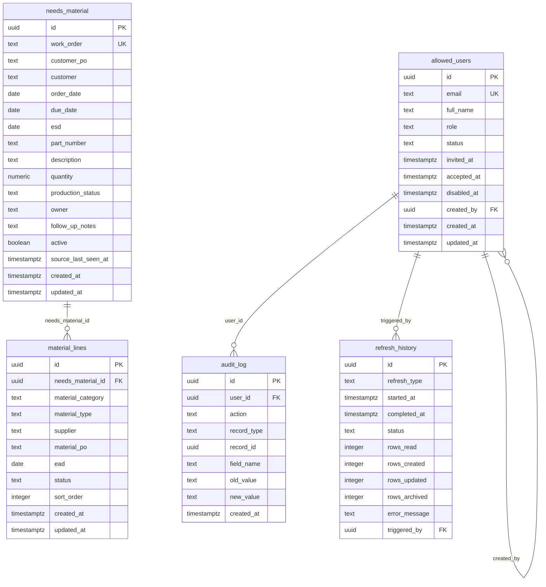

# Needs Material Dashboard — Database Design

This document describes the schema in [`supabase/migrations/001_init.sql`](supabase/migrations/001_init.sql) and seed in [`supabase/seed.sql`](supabase/seed.sql).

**Status:** Schema live in Supabase. App uses Microsoft Entra + `allowed_users` for auth, Supabase for storage, and Microsoft Graph for SharePoint workbook import (`POST /api/refresh`).

**Source of truth for business rules:** [`PROJECT.md`](PROJECT.md)

---

## Design principles

1. Sunday prototype UI remains the visual baseline (main dashboard layout unchanged).
2. **Work order (parent)** holds scheduler fields plus Owner and Follow-Up Notes.
3. **Material lines (children)** hold Flats/Shapes purchasing detail (zero or more per work order).
4. SharePoint refresh updates scheduler parent fields only; it never touches material lines, owner, or notes.
5. Rows that leave `Need Material` are archived (`active = false`), never deleted.
6. RLS is enabled with no public policies; the Next.js server uses the Supabase service role after Microsoft Entra authentication and allowlist checks.

---

## Entity relationship diagram



### Relationship summary

| From | To | Type | On delete | Notes |
|---|---|---|---|---|
| `allowed_users.created_by` | `allowed_users.id` | optional self-FK | `SET NULL` | Who invited/created the user |
| `material_lines.needs_material_id` | `needs_material.id` | required FK | `CASCADE` | Child lines deleted with parent |
| `audit_log.user_id` | `allowed_users.id` | optional FK | `SET NULL` | Actor |
| `refresh_history.triggered_by` | `allowed_users.id` | optional FK | `SET NULL` | Manual refresher; null for cron |
| `audit_log.record_id` | polymorphic | logical | — | `needs_material`, `material_lines`, or `allowed_users` by `record_type` |

---

## Field ownership

| Location | Ownership | Overwritten by SharePoint refresh? |
|---|---|---|
| Scheduler columns on `needs_material` | SharePoint | **Yes** |
| `owner`, `follow_up_notes` on `needs_material` | Dashboard | **Never** |
| All columns on `material_lines` | Dashboard | **Never** |
| `active`, `source_last_seen_at` | Refresh / app | App-managed |

---

# Table: `allowed_users`

## Purpose

Dashboard allowlist and role assignment. Microsoft-authenticated users must also exist here.

## Columns

| Column | Data type | Nullable | Default | Constraints / notes |
|---|---|---|---|---|
| `id` | `uuid` | NO | `gen_random_uuid()` | Primary key |
| `email` | `text` | NO | — | `UNIQUE`; stored trimmed + lowercase; case-insensitive match; format check |
| `full_name` | `text` | NO | — | Display name |
| `role` | `text` | NO | — | `administrator`, `purchasing`, `scheduler`, `viewer` |
| `status` | `text` | NO | `'pending'` | `active`, `pending`, `disabled` |
| `invited_at` | `timestamptz` | YES | — | Invitation time |
| `accepted_at` | `timestamptz` | YES | — | First acceptance / login |
| `disabled_at` | `timestamptz` | YES | — | When disabled |
| `created_by` | `uuid` | YES | — | FK → `allowed_users.id` |
| `created_at` | `timestamptz` | NO | `timezone('utc', now())` | |
| `updated_at` | `timestamptz` | NO | `timezone('utc', now())` | Trigger-maintained |

## Relationships

- Self-FK `created_by`
- Referenced by `audit_log.user_id`, `refresh_history.triggered_by`

## Indexes

- PK `id`
- Unique `email`
- Unique `lower(email)` (`allowed_users_email_lower_uidx`, migration `002`)
- Check `email = lower(btrim(email))`
- `role`, `status`

## SharePoint / dashboard

| Concern | Applies? |
|---|---|
| From SharePoint | No |
| Editable in dashboard | Administration (Phase 7) |
| Never overwritten by SharePoint | Yes (all columns) |

## Example row

```json
{
  "id": "a1111111-1111-1111-1111-111111111111",
  "email": "CHRIS_KANNON_EMAIL_REPLACE_ME",
  "full_name": "Chris Vieux",
  "role": "administrator",
  "status": "active",
  "invited_at": "2026-08-04T19:00:00Z",
  "accepted_at": "2026-08-04T19:00:00Z",
  "disabled_at": null,
  "created_by": null,
  "created_at": "2026-08-04T19:00:00Z",
  "updated_at": "2026-08-04T19:00:00Z"
}
```

## Future expansion ideas

- Entra object id (`entra_oid`)
- `last_login_at`
- Soft-delete (`removed_at`) instead of hard remove

---

# Table: `needs_material` (parent work order)

## Purpose

One record per work order in (or formerly in) Need Material status. Holds scheduler data plus owner and notes. Material purchasing detail is in `material_lines`.

## Columns

### Identity and lifecycle

| Column | Data type | Nullable | Default | Notes |
|---|---|---|---|---|
| `id` | `uuid` | NO | `gen_random_uuid()` | Primary key |
| `active` | `boolean` | NO | `true` | `false` = archived |
| `source_last_seen_at` | `timestamptz` | YES | — | Last seen in SharePoint import |
| `created_at` | `timestamptz` | NO | `timezone('utc', now())` | |
| `updated_at` | `timestamptz` | NO | `timezone('utc', now())` | Trigger-maintained |

### Scheduler-controlled (from SharePoint)

| Column | Data type | Nullable | Overwritten on refresh? |
|---|---|---|---|
| `work_order` | `text` | NO (unique) | Yes (match key) |
| `customer_po` | `text` | YES | Yes |
| `customer` | `text` | YES | Yes |
| `order_date` | `date` | YES | Yes |
| `due_date` | `date` | YES | Yes |
| `esd` | `date` | YES | Yes |
| `part_number` | `text` | YES | Yes |
| `description` | `text` | YES | Yes |
| `quantity` | `numeric` | YES | Yes |
| `production_status` | `text` | YES | Yes |

### Dashboard-controlled on parent

| Column | Data type | Nullable | Overwritten on refresh? |
|---|---|---|---|
| `owner` | `text` | YES | **Never** |
| `follow_up_notes` | `text` | YES | **Never** |

## Relationships

- Parent of `material_lines` (one-to-many)
- No FK to SharePoint

## Indexes

- PK `id`
- Unique `work_order`
- `active`, `due_date`, `customer`, `owner`, `production_status`

## Dashboard display note

The main table still shows **Material Needed**, **Supplier / PO**, and **Expected Arrival** columns (Sunday layout). Values are **aggregated from child lines** for display only (joined material types, supplier/PO summaries, earliest EAD). Editing is done in the Edit dialog’s Flats/Shapes sections.

## Example row

```json
{
  "id": "b2222222-2222-2222-2222-222222222222",
  "work_order": "SO34654.01",
  "customer_po": "30-152476-SS",
  "customer": "DIAMOND C. TRAILERS, LLC",
  "order_date": null,
  "due_date": "2026-06-22",
  "esd": null,
  "part_number": "A-05981-000",
  "description": "IBEAM RAMP - 16\" X 78\"",
  "quantity": 150,
  "production_status": "Need Material",
  "owner": "Chris Vieux",
  "follow_up_notes": "Confirm ship date Friday",
  "active": true,
  "source_last_seen_at": "2026-08-04T15:00:00Z",
  "created_at": "2026-07-01T15:00:00Z",
  "updated_at": "2026-08-04T16:30:00Z"
}
```

## Future expansion ideas

- `owner_user_id` FK → `allowed_users`
- Partial index `WHERE active = true`
- Composite natural key if work orders recycle across years

---

# Table: `material_lines` (child)

## Purpose

Zero or more purchasing material lines under a work order, grouped by **Flats** or **Shapes**. Fully dashboard-controlled.

## Columns

| Column | Data type | Nullable | Default | Constraints / notes |
|---|---|---|---|---|
| `id` | `uuid` | NO | `gen_random_uuid()` | Primary key |
| `needs_material_id` | `uuid` | NO | — | FK → `needs_material.id` `ON DELETE CASCADE` |
| `material_category` | `text` | NO | — | Check: `Flats`, `Shapes` |
| `material_type` | `text` | YES | — | Manual text entry |
| `supplier` | `text` | YES | — | Dashboard-controlled |
| `material_po` | `text` | YES | — | Dashboard-controlled |
| `ead` | `date` | YES | — | Expected arrival date |
| `status` | `text` | NO | `'Not Ordered'` | Per-line status; CHECK list below |
| `sort_order` | `integer` | NO | `0` | Display order within category |
| `created_at` | `timestamptz` | NO | `timezone('utc', now())` | |
| `updated_at` | `timestamptz` | NO | `timezone('utc', now())` | Trigger-maintained |

### Allowed `status` values

- `Not Ordered` (default for new lines)
- `Quote Requested`
- `PO Issued`
- `Supplier Confirmed`
- `In Transit`
- `Partially Received`
- `Received`
- `Problem / Escalation`

Status is stored **only on the material line**, never on the work order header.

## Relationships

- Many lines → one `needs_material`

## Indexes

- PK `id`
- `needs_material_id`
- `material_category`
- `status`
- `(needs_material_id, material_category, sort_order)`

## SharePoint / dashboard

| Concern | Applies? |
|---|---|
| From SharePoint | **No** |
| Editable in dashboard | Yes — Edit dialog Flats/Shapes sections (Status dropdown) |
| Never overwritten by SharePoint | **Yes — entire table, including status** |

## Example rows

```json
[
  {
    "id": "e5555555-5555-5555-5555-555555555555",
    "needs_material_id": "b2222222-2222-2222-2222-222222222222",
    "material_category": "Flats",
    "material_type": "A36 Plate 1/2\"",
    "supplier": "Example Supply",
    "material_po": "PO-2201",
    "ead": "2026-06-20",
    "status": "PO Issued",
    "sort_order": 0,
    "created_at": "2026-08-04T16:00:00Z",
    "updated_at": "2026-08-04T16:00:00Z"
  },
  {
    "id": "e6666666-6666-6666-6666-666666666666",
    "needs_material_id": "b2222222-2222-2222-2222-222222222222",
    "material_category": "Shapes",
    "material_type": "W8x18 Beam",
    "supplier": "",
    "material_po": "",
    "ead": null,
    "status": "Not Ordered",
    "sort_order": 0,
    "created_at": "2026-08-04T16:05:00Z",
    "updated_at": "2026-08-04T16:05:00Z"
  }
]
```

## Future expansion ideas

- `quantity` / unit on the line
- `suppliers` dimension table + `supplier_id`
- Soft-delete lines (`deleted_at`) instead of hard remove for audit continuity

---

# Table: `audit_log`

## Purpose

Append-only history of important changes (parent fields, material lines, admin actions).

## Columns

| Column | Data type | Nullable | Default | Notes |
|---|---|---|---|---|
| `id` | `uuid` | NO | `gen_random_uuid()` | PK |
| `user_id` | `uuid` | YES | — | FK → `allowed_users` |
| `action` | `text` | NO | — | See action vocabulary below |
| `record_type` | `text` | NO | — | `needs_material`, `material_lines`, `allowed_users` |
| `record_id` | `uuid` | YES | — | Logical target |
| `field_name` | `text` | YES | — | e.g. `status`, `ead`, `owner` |
| `old_value` | `text` | YES | — | |
| `new_value` | `text` | YES | — | |
| `created_at` | `timestamptz` | NO | `timezone('utc', now())` | |

## Planned action vocabulary (when APIs land)

| Action | `record_type` | Typical `field_name` | Notes |
|---|---|---|---|
| `update_field` | `needs_material` | `owner`, `follow_up_notes` | Parent dashboard fields |
| `update_field` | `material_lines` | `material_type`, `supplier`, `material_po`, `ead`, **`status`** | Per-line edits including status dropdown |
| `add_material_line` | `material_lines` | null or `material_category` | New Flats/Shapes line; `new_value` may store category / initial status `Not Ordered` |
| `remove_material_line` | `material_lines` | null | Line removed after confirmation |
| `invite_user` / `disable_user` / … | `allowed_users` | as needed | Administration |

Status changes must be audited as **line-level** events (`record_type = material_lines`, `field_name = status`), never as a work-order header field.

## Indexes

- `user_id`, `(record_type, record_id)`, `created_at DESC`

## SharePoint / dashboard

App-owned; not from SharePoint; not overwritten by refresh.

## Example rows

```json
{
  "id": "c3333333-3333-3333-3333-333333333333",
  "user_id": "a1111111-1111-1111-1111-111111111111",
  "action": "update_field",
  "record_type": "material_lines",
  "record_id": "e5555555-5555-5555-5555-555555555555",
  "field_name": "status",
  "old_value": "Not Ordered",
  "new_value": "PO Issued",
  "created_at": "2026-08-04T16:30:00Z"
}
```

```json
{
  "id": "c3333333-3333-3333-3333-333333333334",
  "user_id": "a1111111-1111-1111-1111-111111111111",
  "action": "update_field",
  "record_type": "material_lines",
  "record_id": "e5555555-5555-5555-5555-555555555555",
  "field_name": "ead",
  "old_value": null,
  "new_value": "2026-06-20",
  "created_at": "2026-08-04T16:31:00Z"
}
```

## Future expansion ideas

- `metadata jsonb`, partitioning, revoke UPDATE/DELETE grants

---

# Table: `refresh_history`

## Purpose

Records each SharePoint refresh (manual or scheduled).

## Columns

| Column | Data type | Nullable | Default | Notes |
|---|---|---|---|---|
| `id` | `uuid` | NO | `gen_random_uuid()` | PK |
| `refresh_type` | `text` | NO | — | `manual`, `scheduled` |
| `started_at` | `timestamptz` | NO | `timezone('utc', now())` | |
| `completed_at` | `timestamptz` | YES | — | |
| `status` | `text` | NO | `'running'` | `running`, `success`, `failed` |
| `rows_read` | `integer` | NO | `0` | Rows inspected |
| `rows_matching` | `integer` | NO | `0` | Need Material rows (migration `003`) |
| `distinct_work_orders` | `integer` | NO | `0` | Distinct WO values (migration `003`) |
| `rows_created` | `integer` | NO | `0` | Parent rows inserted |
| `rows_updated` | `integer` | NO | `0` | Parent rows updated |
| `rows_archived` | `integer` | NO | `0` | Parent rows set inactive |
| `rows_failed` | `integer` | NO | `0` | Validation failures (migration `003`) |
| `source_filename` | `text` | YES | — | Workbook name from Graph (migration `003`) |
| `diagnostics` | `jsonb` | YES | — | Blank/duplicate WO, missing columns, etc. |
| `error_message` | `text` | YES | — | |
| `triggered_by` | `uuid` | YES | — | FK → `allowed_users` |

## Indexes

- `started_at DESC`, `status`, `triggered_by`

## SharePoint / dashboard

Run metadata only; refresh must not modify `material_lines`.

## Example row

```json
{
  "id": "d4444444-4444-4444-4444-444444444444",
  "refresh_type": "scheduled",
  "started_at": "2026-08-04T15:00:00Z",
  "completed_at": "2026-08-04T15:00:12Z",
  "status": "success",
  "rows_read": 21,
  "rows_created": 2,
  "rows_updated": 19,
  "rows_archived": 1,
  "error_message": null,
  "triggered_by": null
}
```

---

## Row Level Security

| Table | RLS | FORCE | Public policies |
|---|---|---|---|
| `allowed_users` | Yes | Yes | None |
| `needs_material` | Yes | Yes | None |
| `material_lines` | Yes | Yes | None |
| `audit_log` | Yes | Yes | None |
| `refresh_history` | Yes | Yes | None |

`anon` / `authenticated` privileges revoked when those roles exist. Authorization is enforced in Next.js API routes after Entra + allowlist checks; the service role remains server-only.

---

## Approved Version 1 dashboard mapping

| UI | Behavior |
|---|---|
| Row scope | `active = true` and `production_status = 'Need Material'` only |
| Pagination | None — single sticky-header scrollable table |
| Default sort | `due_date` ascending |
| Columns | WO, Customer PO, Customer, Due Date, Part Number, Qty, Flats, Shapes, Owner, Edit |
| Customer PO | Scheduler-controlled; read-only in Edit modal |
| Flats / Shapes cells | Plain text: `None` / `Complete` / `N Late` / `N Open` (Late before Open) |
| KPI cards | Open WO, Overdue EAD, Due This Week, Waiting on Quote, Late Suppliers — click filters view only |
| Edit dialog | Owner + Notes; Flats/Shapes sections; line fields Material Type, Supplier, Material PO, EAD, Status |
| `+ Add Flats/Shapes Material` | Append child line; status defaults to `Not Ordered` |
| Remove | Confirm, then remove line |
| Save | Persists parent + `material_lines` via authenticated `PUT /api/needs-material/[id]` |
| Normalize | Missing line `status` → `Not Ordered`; legacy header status mapped when present |

---

## Data loading (current app)

- Work orders and material lines are loaded from Supabase via `GET /api/needs-material`.
- If `needs_material` is empty, the API seeds once from `data/sample-data.js`, then returns DB rows.
- Edits save through `PUT /api/needs-material/[id]` and write `audit_log` entries.
- Browser `localStorage` is not used for Needs Material rows or allowlist users.
- Microsoft Entra sign-in + `allowed_users` gate access; roles are enforced server-side on API routes.
- Server uses `SUPABASE_URL` + `SUPABASE_SECRET_KEY` only (never in client bundles).

---

# Schema review — possible improvements

## Normalization

Parent/child split for materials is the correct normalization for Flats/Shapes. Optional later: `suppliers` table, `owner_user_id` FK.

## Performance

Index on `(needs_material_id, material_category, sort_order)` supports Edit dialog loads. At expected volume, joins for dashboard aggregates are fine. Later: materialized summary columns only if needed.

## Future scalability

- Concurrent refresh locking still recommended before SharePoint go-live
- Cascade delete on lines is correct for hard parent delete; production should archive parents instead of deleting

## Audit history

Log `add_material_line` / `remove_material_line` / per-field line updates (including **`status`**) when APIs land. Never log material status against the parent work order.

## Supplier history / attachments / comments / notifications

Still out of scope for first production release (see prior recommendations). Prefer line-level events table if supplier history is needed later.

---

## Document control

| Item | Value |
|---|---|
| Schema file | `supabase/migrations/001_init.sql` |
| Seed file | `supabase/seed.sql` |
| Setup guide | `docs/supabase.md` |
| This document | `DATABASE.md` |
